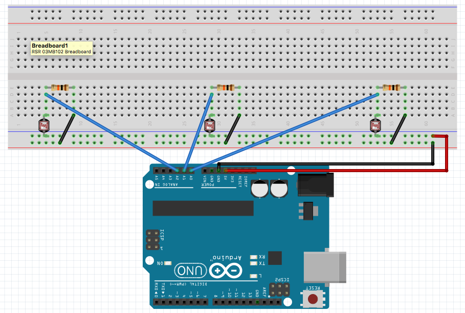
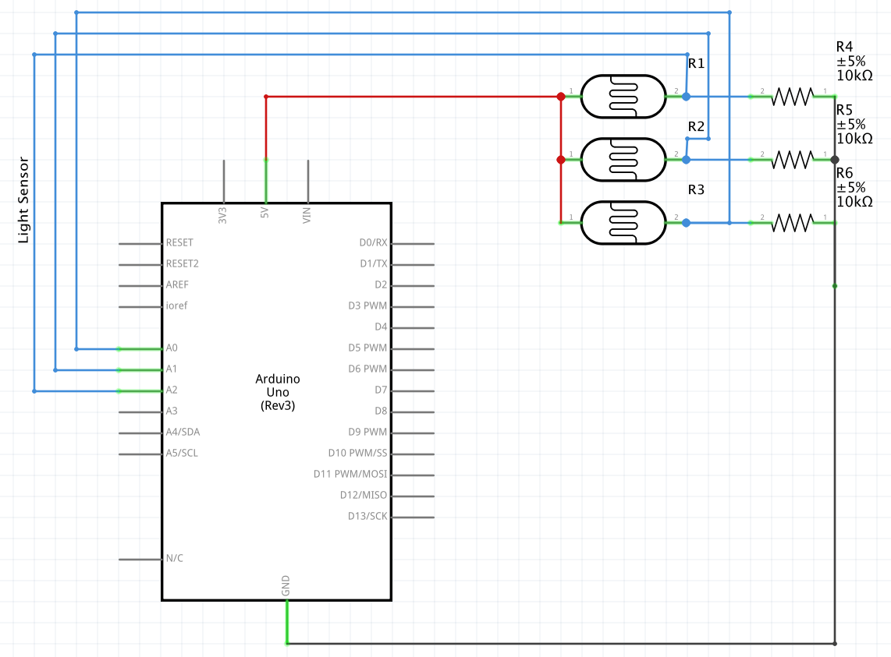

# Backlight Sensor

Update screen backlight based on the area's light levels

## Install

`git clone git@github.com:RyanScottLewis/backlight_sensor.git`

## Setup

Upload the `src/backlight_sensor.ino` to the microcontroller and use the following setup:

### Breadboard



### Schematic



## Usage

### Executable

```sh
$ backlight_sensor --help
```

## Copyright

Copyright © 2016 Ryan Scott Lewis <ryanscottlewis@gmail.com>.

The MIT License (MIT) - See License.md for further details.
